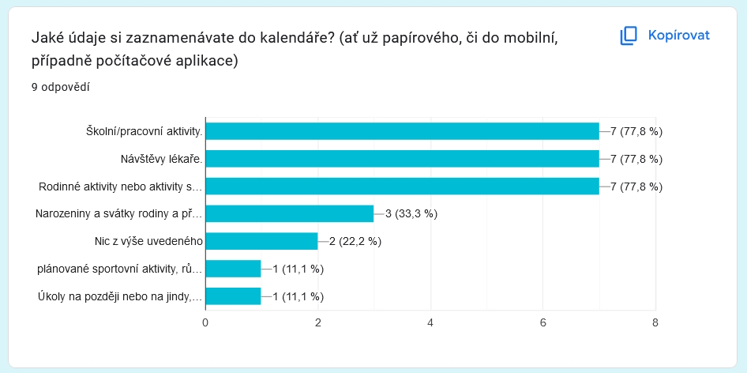
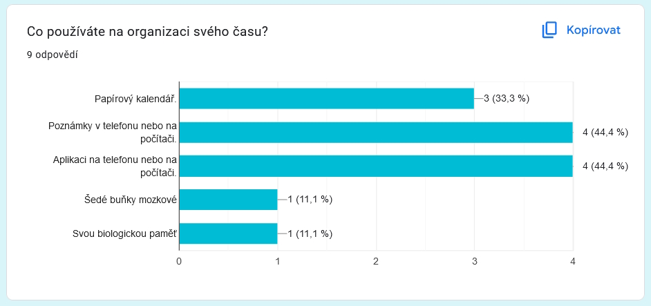
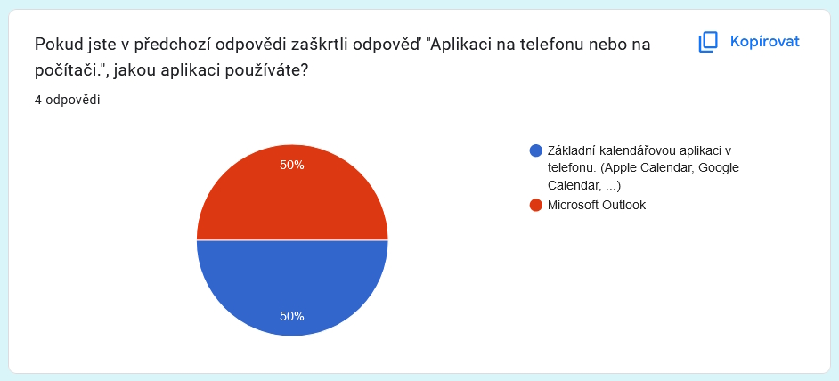
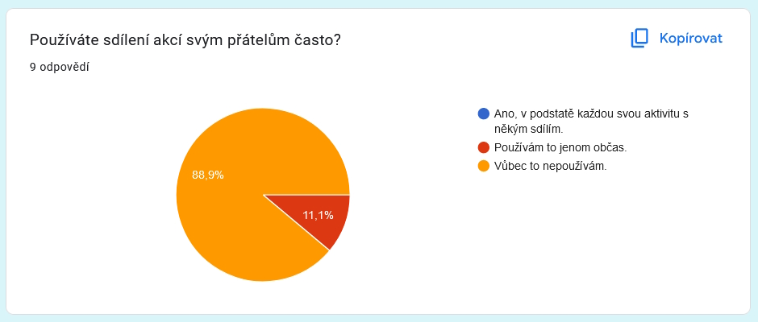
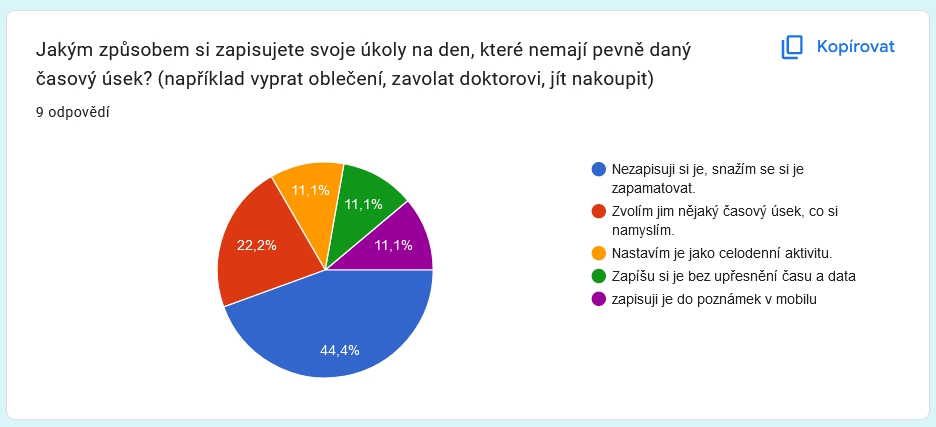
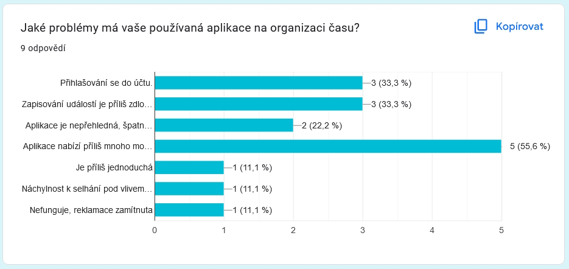
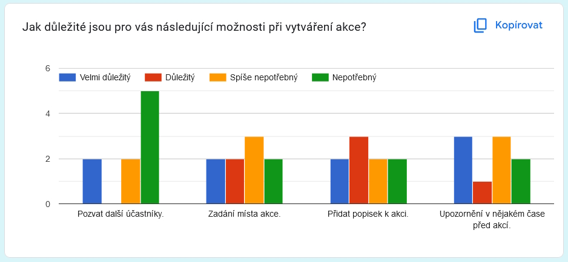
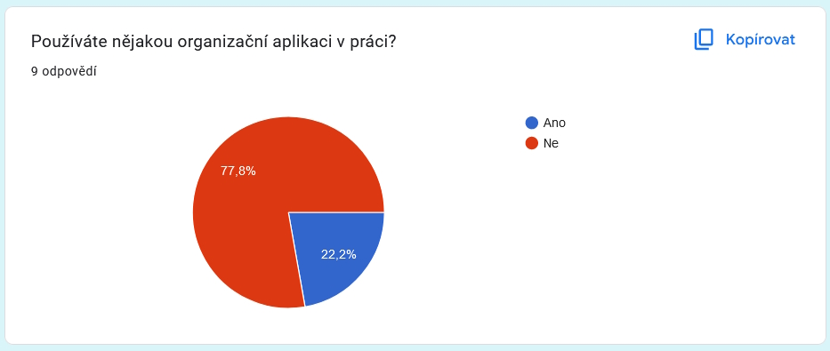

# Zpráva o návrhu

- Ondřej Koumar (xkouma02)
- Adam Malysák (xmalys02)
- Ondřej Lukášek (xlukas15)

## Chytrý zápisník událostí a poznámek (xkouma02)

V dnešní době snad každý používá nějakou aplikaci pro organizaci času a nepotřebu si pamatovat každou schůzi, každý úkol (ať už do práce, do školy, co by člověk rád udělal doma, atd.), ale i třeba věci jako nákupní seznam. Snad už ani nemá smysl se bavit o zápisnících a papírových kalendářích, které se dnes již skoro vůbec nevidí. 

Jednou z takových aplikací je například Google Calendar. Tato aplikace je nabitá funkcionalitou a umí toho opravdu hodně. A to je vlastně ten důvod, proč bych se rád vrhnul do stavby podobné aplikace. Google Calendar je na můj vkus až příliš "overkill" k tomu, aby si člověk jen velmi jednoduše zapsal schůzky, deadlines a různé podobné aktivity. 

Naše aplikace by tedy sloužila uživatelům zároveň jako jakýsi kalendář aktivit, ve kterém jsou pouze nejnutnější položky pro aktivitu, a zároveň jako TODO list, kde by si zapisovali veškeré věci, které během dne potřebují udělat, ale nevědí, kdy přesně. Další prvek, který by byl uživatelům poskytnut, je vytváření vzorů pro různé aktivity. Při vytváření nové aktivity by si místo proklikávání všemi parametry jen zvolili vzor, atributy aktivity by se automaticky doplnily a uživatel by si změnil pouze to, co by nutně potřeboval, například detailnější popis aktivity.

Další vlastností aplikace by byla možnost si dané aktivity "otagovat", tedy označit tagy, které si uživatel sám nadefinuje. Podle tagů pak může uživatel aktivity filtrovat. Příkladem takového tagu by mohl být například "sport".

Cílovou skupinou by měli být pak lidé, kteří hledají aplikaci pro plánování aktivit a TODOs bez zbytečných extra prvků, které zhoršují plynulost dělání jednoduchých úkonů v aplikaci.

## Mobilní aplikace pro filmovou databázi (xmalys02)

S některými mými přáteli sdílíme lásku k filmu. Rádi dáváme najevo, co si o nich myslíme, rozšiřujeme si obecné povědomí o filmové popkultuře jako takové, nebo třeba rádi zjišťujeme zajímavosti o různých filmech. Velice často se proto pohybujeme na stránce ČSFD.cz (Česko-Slovenská filmová databáze). Jsme zvyklí na její strukturu a na její funkcionalitu. Na co si ovšem zvyknout nemůžeme, je mobilní aplikace ČSFD.cz. 

Mobilní aplikace má hodně problémů. Největší z nich je, že v ní chybí některá funkcionalita z webového prohlížeče, ale tváří se, že ji splňuje. Dále úvodní stránka je velice omezená a některé funkce tam fungují velice diskutabilně. 

V prohlížeči je na hlavní stránce hodně různých "tabulek" (nejnavštěvovanější filmy, nejnavštěvovanější seriály, nejnavštěvovanější herci, nové recenze TOP uživatelů, ...), kdežto v aplikaci je jen zlomek toho. Buď by tam šlo dát víc věcí a nechat uživatele scrollovat na tu, která ho zajímá, nebo uživatele nechat, ať si vybere to, co ho zajímá a nechá si to na hlavní stránce zobrazovat. Některé tyto věci (např. Novinky) v aplikaci kompletně chybí.

Některé věci, které v mobilní aplikaci chybí považuji za naprosto základní. Rozšíření této aplikace by tedy mohlo poskytnout příjemnější prostředí i pro nové uživatele, i pro stávající.

## Kuchařka pro ukládání receptů (xlukas15)

Často se ve svém okolí setkávám s lidmi, kteří dodnes mají svoje recepty v nějaké své sbírce receptů.
Také je dost časté, že mají spoustu záložek ve všech svých kuchařkách.
Asi poslední varianta, co vídám, je, že mají recepty "poházené" na papírech, které potom ztratí nebo jen zrovna nemohou najít,
což prakticky blokuje jakoukoli možnost vaření podle receptu, pakliže si ho sami napamatují.

Chytrá kuchařka by tyto problémy mohla snadno řešit.
Uživatelé by si do ní mohli svoje recepty ukládat a nemuseli je díky tomu nikdy hledat, protože by je měli vždy na svém počítači,
nebo v případě rozšíření na mobilních telefonech a tabletech.

Aplikace by umožňovala nejen ukládat recepty (název, postup, seznam surovin), ale i samotné suroviny. U těch by bylo možné zadat i nutriční údaje,
aby si je lidé nemuseli neustále vyhledávat, ale měli je ihned po ruce. Tím by byla vhodnější pro lidi, co si hlídají svůj denní příjem.
V případě rozšíření by aplikace také mohla mít možnost exportu receptů nebo případně nějakou formu jejich sdílení mezi své přátele.

Při chytrém návrhu UX by tak aplikace mohla sloužit lidem jak s nízkými schopnostmi práce s aplikacemi, tak i těm zdatnějším.
Cílovou skupinou by tak byl prakticky kdokoliv, kdo by měl zájem mít všechny svoje recepty na jednom místě a mít je přehledné.

## Vybrané tema (zápisník)

Vybrali jsme téma navržené kapitánem (xkouma02), tedy chytrý zápisník událostí a poznámek.

Nejdříve jsme kolektivně zavrhli téma navržené kolegou Malysákem (xmalys02), protože bylo nad naše možnosti, hlavně vzhledem k
času k vypracování projektu.

Mezi zbylými dvěma tématy jsme nemohli rozhodnout, ale poté jsme usoudili, že bude lepší vybrat si téma zápisníku událostí, protože
k tomuto tématu máme blíže a vzniklou aplikaci bychom i sami použili. Aplikaci kuchařky navrženou kolegou Ondřejem Lukáškem (xlukas15)
by nikdo z nás asi nepoužil.

## Uživatelské potřeby

Pro analýzu uživatelských potřeb jsme se rozhodli udělat dotazník.
Ten byl proveden formou Google Forms a odkaz na něj je [zde](https://docs.google.com/forms/d/e/1FAIpQLSc_8gJi0I01YQoS2cMm3qATbbzEG8eU3Uu_74xMexYKysFVFw/viewform?usp=sf_link) (odkaz respondenta).
Celkově se dotazník skládal z osmi otázek, na ty bylo možno odpovídat následujícími způsoby:

- vybrat jednu možnost,
- vybrat více nabízených možností,
- určit důležitost (stupně "Velmi důležitý", "Důležitý", "Spíše nepotřebný" a "Nepotřebný").

### 1 - Jaké údaje si zaznamenávate do kalendáře? (ať už papírového, či do mobilní, případně počítačové aplikace)

__Možné odpovědi:__

- Školní/pracovní aktivity.
- Návštěvy lékaře.
- Rodinné aktivity nebo aktivity s přáteli.
- Narozeniny a svátky rodiny a přátel.
- Jiná...

Tato otázka byla primárně zaměřená na to, abychom zjistili, co si uživatelé ve své aplikaci pro organizaci vlastně ukládají, případně co jiného si ukládají.
Jako možnosti jsme dali varianty, které sami používáme.

Jak lze vidět, nejčastější jsou zejména školní a pracovní aktivity, návštěvy lékaře a rodinné aktivity.
Tedy nejvíce využívanými jsou právě ty nejtypičtější úlohy na zapamatování. Ty, co si představí asi každý. Aplikace je tedy musí podporovat.

Uživatelé si také v menšině zapisují i narozeniny a svátky lidí okolo nich.

Nakonec respondenti, co neodpověděli na nic z uvedeného napsali, že si zapisují jejich naplánované sportovní aktivity, různé schůzky a úkoly na později nebo na jindy.
V prvním případě se tedy jedná o spíše osobní záležitosti, v tom druhém zase o úkoly, na které je v dotazníku otázka později.

### 2 - Co používáte na organizaci svého času?

__Možné odpovědi:__

- Papírový kalendář.
- Poznámky v telefonu nebo na počítači.
- Aplikaci na telefonu nebo na počítači.
- Jiná...

Tuto otázku jsme položili respondentům z důvodu, abychom viděli, čemu bychom se vlastně měli snažit vyrovnat, jak by měla aplikace fungovat, co by měla umět, také abychom se mohli podívat na možná konkurentní řešení.

Zde je první otázka, kde se setkáváme s nevalidními odpověďmi. Jsou to ty dvě, které jsou na spodu obrázku, tedy "Šedé buňky mozkové" a "Svou biologickou paměť".
Zde se bohužel s největší pravděpodobností jedná o vtip ze strany respondentů a bohužel je tedy jejich odpověď neplatná. Zbylé odpovědi jsou naštěstí validní.

Z nich vyplývá to, že nejčastěji jsou na organizaci času využívané aplikace na telefonu nebo počítači, případně poznámky na telefonu nebo počítači.
Také je však využíván i papírový kalendář.

Zejména se tedy jedná o lidi, kteří mají zájem o co nejrychlejší a nejjednodušší řešení, které splní svůj účel.

### 3 - Pokud jste v předchozí odpovědi zaškrtli odpověď "Aplikaci na telefonu nebo na počítači.", jakou aplikaci používáte?

__Možné odpovědi:__

- Základní kalendářovou aplikaci v telefonu. (Apple Calendar, Google Calendar, ...)
- Microsoft Outlook
- Jiná...

V této otázce jsme se snažili hlavně zjistit, jaké aplikace respondenti na řešení své organizace využívají.
Hlavně nás zajímalo, jaké různé aplikace ve světě jsou a pomocí toho jsme se to mohli dozvědět.
Doufali jsme tedy, že se tedy bude hojně využívat možnosti jiná, ovšem opak byl pravdou.

K žádnému zázračnému zjištění jsme bohužel nedošli, protože respondenti využívají buď nějakou základní aplikace, které jsou už předinstalované v mobilu nebo používají na svoje úkoly Microsoft Outlook.

### 4 - Používáte sdílení akcí svým přátelům často?

__Možné odpovědi:__

- Ano, v podstatě každou svou aktivitu s někým sdílím.
- Používám to jenom občas.
- Vůbec to nepoužívám.

### 5 - Jakým způsobem si zapisujete svoje úkoly na den, které nemají pevně daný časový úsek? (například vyprat oblečení, zavolat doktorovi, jít nakoupit)

__Možné odpovědi:__

- Nezapisuji si je, snažím se si je zapamatovat.
- Zvolím jim nějaký časový úsek, co si namyslím.
- Nastavím je jako celodenní aktivitu.
- Jiná...

### 6 - Jaké problémy má vaše používaná aplikace na organizaci času?

__Možné odpovědi:__

- Přihlašování se do účtu.
- Zapisování událostí je příliš zdlouhavé a detailní.
- Aplikace je nepřehledná, špatně se v ní orientuje.
- Aplikace nabízí příliš mnoho možností, je příliš složitá.
- Jiná...

### 7 - Jak důležité jsou pro vás následující možnosti při vytváření akce?

Tato otázka byla trochu jiná, než všechny ostatní, protože zjišťovala důležitost nějaké z níže uvedených funkcí.
Respondenti měli na výběr ze 4 různých úrovní důležitosti:

- Velmi důležitý.
- Důležitý.
- Spíše nepotřebný.
- Nepotřebný.

Tyto stupně byly vybrány na základě toho, aby vykazovaly větší jednoznačnost, než odpovědi typu "Nevím", "Nejsem si jistý", a tomu podobné.

__Funkce:__

- Pozvat další účastníky.
- Zadání místa akce.
- Přidat popisek k akci.
- Upozornění v nějakém čase před akcí.

### 8 - Používáte nějakou organizační aplikaci v práci?

__Možné odpovědi:__

Otázky v dotazníku budou probrány a zanalyzovány formou kapitol.

Celkově měl dotazník **9 respondentů**, nicméně některé odpovědi byly znehodnoceny, což bude popsáno v kapitolách, kterých se to týká.
Těchto znehodnocených odpovědí bylo naštěstí velmi málo.

### Analýza odpovědí

**TODO**

nejaky conclusion...

## Existující aplikace

### Google Calendar (xkouma02)

K aplikaci Google Calendar jsem se již trochu rozepsal, ale vezměme to trochu podrobněji.

Google Calendar je aplikace pro organizaci schůzí, setkání, událostí, volného času, ale umožňuje i dosti pokročilé věci, jako například sdílení kalendářů mezi uživateli, propojení aplikace s diskem Google, GMailem. Při vkládání aktivit pak podporuje různé základní věci jako čas, popis, barva, lokace, nicméně je tam spousta věcí, které amatérský uživatel nevyužije, jako například video conferencing přes google meet, přidání přílohy, změna viditelnosti, apod.

Velkou předností aplikace je univerzálnost při zachování relativně solidní jednoduchosti. Může jej používat úplný laik s cílem si zapsat pár TODOček a aktivit během dne, nicméně to využije i ostřílený kalendářový profesionál, který u Google využívá úplně všechny služby a vyžaduje pro své potřeby těžkotonážní kalendář.

Naopak slabinou je právě ta již zmiňovaná *relativní* jednoduchost, která by se pro nenáročné uživatele dala vylepšit a po které bych mířil. Díky jednoduchosti bychom mohli mířit na velmi širokou škálu uživatelů, do které by zapadli i technicky velmi nezkušené osoby. 

### Aplikace na poznámky (Apple Notes, Samsung Notes, ...) (xmalys02)

Samsung notes je v podstatě elektronický poznámkový blok. Já osobně ho používám, asi protože jsem, jak jsem již dříve zmínil, velmi konzervativní a podobné základní aplikace jsem používal na každém svém telefonu asi od chvíle, co jsem nějaký telefon vlastnil. 

Podle mě je největší předost aplikace ta, že její použití ve velice snadné. I starší lidé, kteří tomuto modernímu světu moc nerozumí a nestíhají ho, by tuto aplikaci mohli do určité míry používat.

Největší nedostatek je určitě ten, že tato aplikace poskytuje velmi málo funkcionality. Je to v podstatě jako tužka a papír, akorát v elektronické podobě. Organizace informací je hodně o tom, kolik si s tím uživatel dá práce.

V takové aplikaci na poznámky může být úplně všechno, což je taková dvousečná zbraň. Pokud bych tuto aplikaci chtěl používat výhradně na evidování aktivit, jejich časů, popisu atd. a nějak je propojit, moje možnosti jsou velmi omezené. Určitě by bylo lepší se zaměřit na nějaké téma (aktivity, todo list, projekty) a tomu aplikaci přizpůsobit funkčně i vzhledově.

### Toggl Track (xlukas15)

[Toggl Track](https://toggl.com/track/) je velice chytrá aplikace pro zaznaménávání aktivit. Aktivity si umožňuje rozdělovat do různých skupin a ty následně různě nazývat.
Například si udělám skupinu *ITU projekt* a do kalendáře si mohu zaznamenat například, že v úterý od 16 do 18 hodin budu mít meeting na analýzu odpovědí z dotazníku.
Obdobným způsobem si mohu udělat skupinu *Osobní* a do ní si následně dát například divalo, kino a podobně.
Následně se můžu na svoje aktivity koukat v přehledném kalendáři, případně si prohlížet moje statistiky o tom, kolik času jsem kterými aktivitami strávil.

Aplikace se hodně prezentuje také možností začít okamžitě zaznamenávat aktivitu. Zní to zajímavě, ale potíž je v tom, že ji uživatel musí sám manuálně zapnout a vypnout.
To je problém, protože se pak může stávat, že na to uživatel zapomene.

Zároveň je také tato funkce zřejmě určená primárně na použití v pracovních prostředích, nicméně je dostupná i pro osobní použití.
A Toggl Track obsahuje spoustu jiných, podobných funkcí, jako je třeba sestavování rozpočtu projektu na základě naplánovaného času, funkce pro vyúčtování a fakturace nebo
třeba pracovní hlášení.

Všechny tyto funkce tedy působí na první pohled zajímavě, nicméně pro osobní použití uživatelů nemají příliš velké využití.
Dokonce to způsobuje, že aplikace tak působí hodně složitě a minimálně při začínání s ní dost nepřehledně.
Díky tomu by pak Toggl Track mohl hůře používat lidem, co nejsou s ovládáním aplikací tolik zdatní.

Jako finální řešení by tedy bylo vhodné ponechat nějakou formu rozdělování aktivit do skupin (například podle barev), které podporují přehlednost aplikace.
Naopak by bylo dobré zase odstranit funkce, které jsou pro jednotlivce spíš zbytečné, jako již zmíněný okamžitý start aktivity, sestavování rozpočtu, vyúčtování,
fakturace, pracovní hlášení a další.

## Klíčové vlastnosti aplikace

Na základě zjišťování údajů o konkurenčních aplikacích a rozeslaného dotazníku nám vyplynulo následující.

### Uživatelé

Pokud sdílí více uživatelů jedno zařízení (z našeho výzkumu se zjistilo, že se to děje).
Díky tomu by mohli uživatelé mít svoje aktivity jenom na svém účtu a nepletly by se mezi ostatními aktivitami dalších uživatelů počítače.
Také by bylo uživatelsky přívětivé umožnit při vytváření nového profilu nastavit profilový obrázek a uživatelské jméno.

### Aktivity

Měla by existovat nějaká možnost zapisování klasických údajů, akcí, aktivit.
Ty by měly mít nějaký časový rozsah, popis, samozřejmě název a možnost nějakého specifického označení.
Díky tomu by se dalo lépe orientovat mezi aktivitami.
Typicky bych mohl označit třeba domácí aktivity, rodinné aktivity, pracovní povinnosti, atd...

### Tagy

Specifické označení aktivit by mohlo být realizováno přidělováním tagů.
Došlo by tak k dalšímu zpřehlednění práce s aplikací.
To je, jak vyplynulo z dotazníku, jeden z hlavních klíčových cílů našeho řešení.
Také to bylo hezky vidět na konkurenční aplikaci **Toggl Track**, která tuto funkci měla (v trochu jiné podobě) a práce tak byla o něco přehlednější.

### TODO-list

Měla by pro uživatele existovat možnost si vytvořit aktivity, které nemají žádné časové omezení, ale pouze denní omezení, ale měly by se někdy udělat.
Typicky by pod to patřily úkoly, které se mají provést do nějakého dne (deadlinu).
Uživatel by měl mít možnost si zaškrtnout úspěšné vykonání dané události, čímž by se mu smazala z jeho seznamu úkolů.
Mezi tyto aktivity by mohli patřit úkoly jako "jít se psem", "umýt nádobí", "převléct postel", "zavolat doktorovi", a podobně.

### Možnost editace

Všechny uživatelské profily, aktivity, tagy a úkoly (TODOs) by mělo být možné také upravovat.
To je užitečné pokud se změní okolnosti nějaké již vytvořené události nebo pokud při vytváření události došlo k omylu (například pravopisné chybě).

## Rozdělení práce

Rozhodli jsme se pro rozdělení práce způsobem číslo 2, tedy každý člen pracuje na části aplikace, výsledkem je jedna aplikace.

### Kapitán Ondřej Koumar

Kapitán Koumar bude pracovat na propojování backendu s frontendem (hlavně viewmodely).
A v backendu bude asistovat na databázové vrstvě.
V samotném GUI bude mít za úkol 3 obrazovky (views).
Konkrétně úvodní stránku s výběrem profilu, tvorbu profilů a úpravu profilů.

### Důstojník Ondřej Lukášek

Důstojník Lukášek bude (spolu)pracovat na pokrytí backendu testy.
V GUI bude mít za úkol vytvořit 5 obrazovek. Konkrétně stránka todo, tvorba todo, stranka tagů, tvorba tagů a úprava tagů.

### První důstojník Adam Malysák

První důstojník Malysák bude mít na starost backend, s tím, že mu oba kolegové budou k ruce.
V GUI bude mít za úkol vytvořit 3 obrazovky, a to: stránku aktivit, úpravu aktivit a tvorbu aktivit.

## Popis GUI návrhu

### Ondřej Koumar (xkouma02)

**TODO**

- popis navrhu
- conclusion z testovani

**TODO**

### Adam Malysák (xmalys02)

**TODO**

### Ondřej Lukášek (xlukas15)

**TODO**

## Popis architektury

Aplikace bude napsána v jazyce C#, na platformě .NET 7. Pro návrh aplikace bude použit návrhový vzor
Model-view-viewmodel (MVVM).

Naše aplikace má 3 vrstvy. Databázovou, business a aplikační.
V databázové vrstvě se nachází entity, které se mapují do relační databáze (sqlite) a případně o vrstvu výš, na modely.
Jsou zde třídy, které přímo pracují s databází (CRUD) a třídy, které jsou využívány business vrstvou pro práci s databází.

V business vrstvě je veškerá funkcionalita aplikace.
Jsou zde fasády, pomocí kterých pracujeme s databázovou vrstvou, mapují entity z databázové vrstvy na modely
a také implementují funkcionalitu, jako je například filtrace aktivit podle data, nebo podle tagu.

V aplikační vrstvě se budou nacházet views a viewmodely. K samotné implementaci grafického uživatelského rozhraní (tedy views)
použijeme framework WPF. Tento framework jsme vybrali po vyzkoušení WPF na cvičení. Zároveň máme několik málo zkušeností s
.NET maui, které by mělo být alespoň v něčem trošku podobné. Také jsme tuto volbu konzultovali s přednášejícím.
